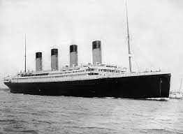

# Titanic Case Study:
### Analyzing Titanic Survival Variables

A comprehensive analysis of the Titanic disaster, focusing on identifying key factors that influenced passenger survival rates using machine learning and data visualization techniques.
**Date:** 17/Jun/2024

## Summary
- [Introduction](#introduction)
- [Data Preparation](#datapreparation)
-

## Introduction:

  **Title:** Analyzing Titanic Survival Variables
  
  **Industry_Focus:** Maritime Safety and Transportation
  
  **Problem Statement:** To identify the key factors that influenced passenger survival during the Titanic disaster.
  
  **Business Use-Case:** Improving safety measures and emergency protocols for maritime travel by understanding the variables that affected survival rates in a historical context. This analysis aims to provide insights that can be applied to modern safety regulations and passenger management.
  
  **Goals Metrics:**
  
    - Determine the impact of demographic variables (age, gender) on survival rates.
    
    - Analyze the influence of socio-economic status (ticket class) on survival chances.

    - Assess the role of embarkation point on passenger survival.
    
    - Identify patterns and correlations between passenger attributes and survival outcomes.
    
    - Develop predictive models to estimate survival probabilities based on the identified variables.
    
  **Deliverables:**
  
    - A comprehensive report detailing the findings and insights from the data analysis.
    
    - Visualizations (graphs, charts) that illustrate key patterns and relationships in the data.
    
    - A predictive model with performance metrics and validation results.
    
    - Recommendations for improving maritime safety based on the analysis.
    
    - Presentation slides summarizing the study for stakeholders.
    
  **Dataset List:**
  
    - Titanic Passenger Data from Kaggle (includes demographics, ticket information, survival status).
    
    - Additional historical records (if any) for validation and supplementary analysis.
    
  **Websites to scrape data_needed:**
  
    - [Kaggle Titanic Dataset](https://www.kaggle.com/datasets/heptapod/titanic)

    - Historical archives websites for supplementary passenger records, such as [Encyclopedia Titanica](https://www.encyclopedia-titanica.org/)

## DataPreparation
#### 1. Cleaning and Processing Data

#### 2. Handling Missing Values and Outliers

#### 3. Creating derived variables (e.g., family size, fare per person)
